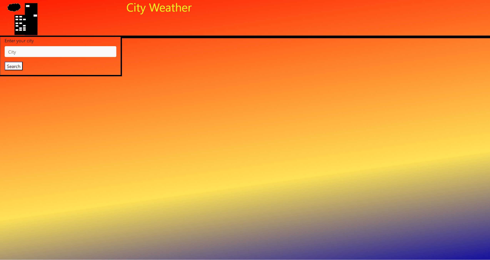

# City Weather
    
## Description
This is an application designed to display weather in a specified city.

## Table of Contents
- [Description](#description)
- [Installation](#installation)
- [Use](#use)    
- [Questions](#questions)

    
## Installation
Go to https://katherine-be.github.io/City-Weather/
    
## Use
Search for a city and the weather will populate in a new city tab. If you wish to view a previous city's weather, click on that tab.

##  Credits

## Questions
Katherine-Be
ka.alex.bensley@gmail.com
